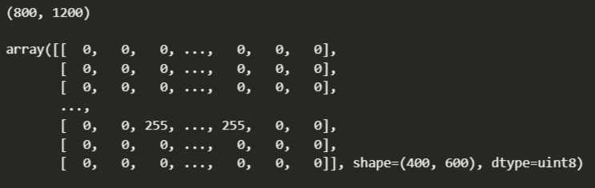
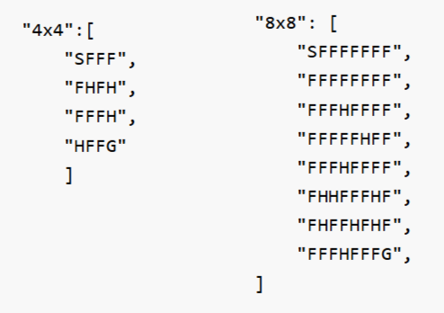

# Будем обучать агента добираться до нужного поля.
## Генеральная цель: на видео обучить нейронку находить враждебные объекты (сегментация), а с помощью обучения с подкреплением научить АГЕНТА расознавать врагов и добираться до целевой точки, обходя их.
## Цель: обучить точку добраться до нужного прямоугольника.
1. Создаем картинку с препятствиями с помощью рисовалки paint.
2. Переводим матрицу в поле цифр 800 х 1200.
3. 


>Важно! Установка пакетов requirements.txt, прежде чем егозапускать с помощью **pip install -r requirements.txt**, нужно создать файлик .py и .ipynb, после чего создаем среду .conda выбираем ее для .py (не забываем добавить среду в переменные окружения windows), в файлике .ipynb создаем простую мат. операцию и запускаем, после чего появится запрос на подключение kernel, выбираем нашу среду .conda. После этих манипуляций проблем с requirements.txt не должно возникнуть.

## 1. Создаем картинку с препятствиями с помощью рисовалки paint.
1.1 !!! Обязательно. Сохранять картинку в формате png, а не в jpg, т.к. в jpg появляются артефакты, т.е. помимо значений [0, 255, 144] появляются всякие 254, 143 и пр., аэто совсем не надо, это наверно из-за сжатия формата jpg.
1.2 Изменение размера картинки выполняется с помощью:

>* label_mask_real_size = cv2.resize(image_array[0], (300, 200), interpolation=cv2.INTER_NEAREST)
 
 параметр interpolation=cv2.INTER_NEAREST обязательный, чтобы не появлялись артефакты

итоговая матрица:



Таким образом получили матрицу 400х600, тип данных unit8, значения [0, 255, 144] 

0 - черный цвет (препятствия)
255 - белый цвет (свободное поле)
144 - целевое поле серого цвета, сюда мы должны научиться доходить
??? - агента пока нет

1.3 Для обучения будем использовать среду: Frozen Lake

Чтобы ей можно бы лов оспользоваться, нужны пользовательские корректировки.

Вот в каком виде поле должно подаваться на обучение:



, где

S -  это агент
F - свободное поле
H - препятствия
G - цель

Теперь нашу картинку (массив np.array) нужно перевести в вышеуказанную форму

**1.2 Разбиваем видео на кадры, получая картинки в формате png**

Программка: [FFmpeg](https://ffmpeg.org/download.html).
Чтобы она работала в командной строке, необходимо в "Переменных среды" прописать путь _C:\\ffmpeg\bin_. После этого в командной сроке пишем:
```
ffmpeg -i training_model/video/video.mp4 -vf fps=3.0 training_model/images_train/1_img%03d.png
```
>* ffmpeg -  это команда для запуска программы FFmpeg, которая используется для обработки
видео и аудио файлов
>* --i training_model/video/video.mp4 - это опция для указания входного файла train.mp4
>* -vf fps=1.5 - это опция для указания фильтрации видео с заданной частотой кадров в 1.5 кадра
в секунду
>* training_model/images_train/1_img%03d.png - это опция для указания выходной директории и формата имени 
файлов, где %03d означает использование трех цифр для нумерации файлов (папку для картинок нужно создать вручную)


**1.3 Разметка картинок с помощью [CVAT](https://www.cvat.ai/).**

 Очень удобный редактор, в моем случае я его поднял локально, используя [образ Docker](https://docs.cvat.ai/docs/administration/basics/installation/).


